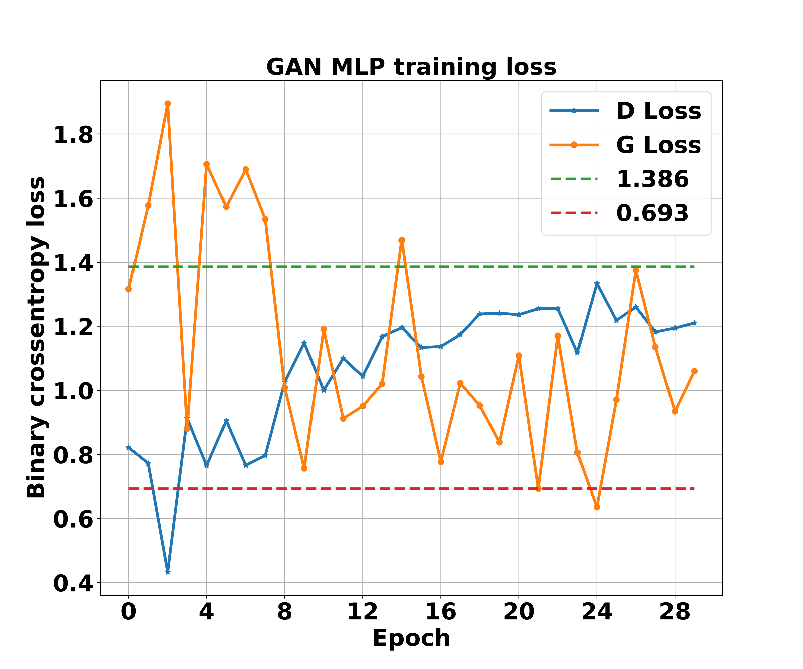
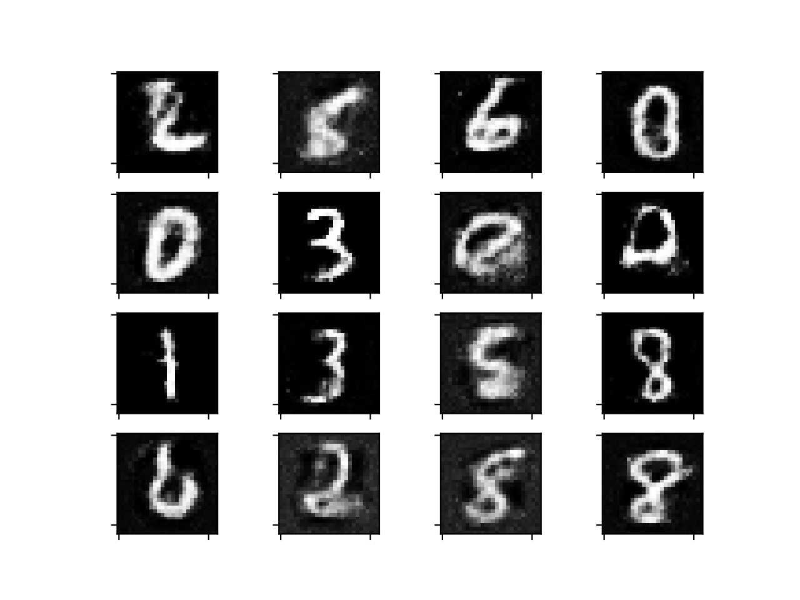

This is the code for implementing GAN from Goodfellow et. al. 2014.
I have network architecture used exactly same as in the paper but with small differences in discriminator hidden layer activations and in scaling.
I keep track of loss values for generator and discriminator to check the network performance over time.
As given in the theorem 1 of the paper, loss values that I achieved are pretty close to ideal loss values for the GAN.
Figure below show the loss upon training for 30 epochs and generated images after that.

