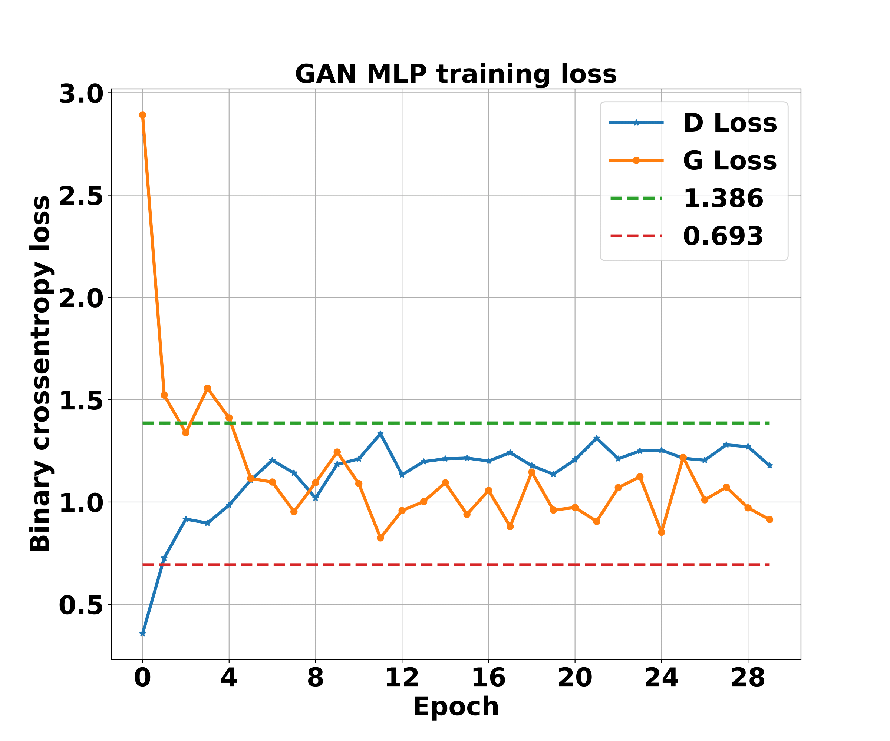

This is the code for implementing GAN from Goodfellow et. al. 2014 in tensorflow.
This network architecture is same as in the paper but with small differences in discriminator hidden layer activations and in scaling.
Code keeps track of loss values for generator and discriminator to check the network performance over time.
Theorem 1 of the paper talks about the optimal loss values, loss values that achieved here are close to ideal loss values for the GAN.
Figures below show the loss upon training for 30 epochs and generated images after that.

